# ry-vue-lxgl
基于若依框架分离版的毕业离校管理系统
> 系统架构图
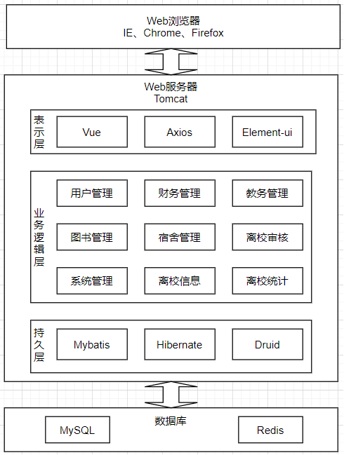

系统用户总共分为：系统管理员、部门管理员、辅导员、毕业生。

> 用户信息管理模块
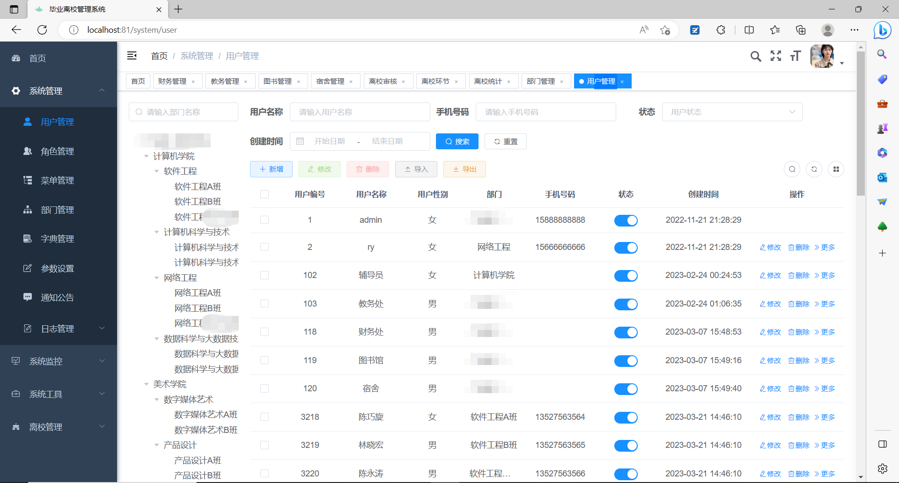

> 财务信息管理模块
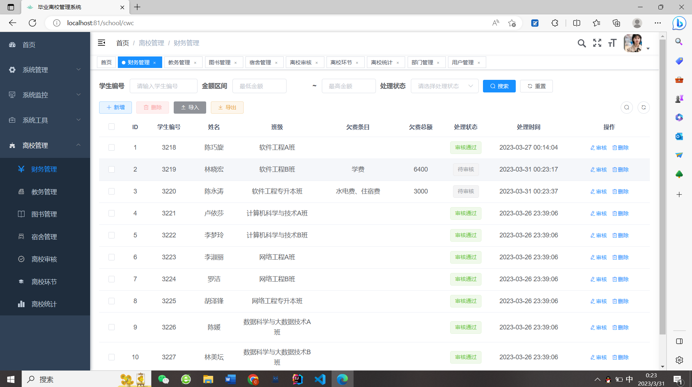

> 教务信息管理模块
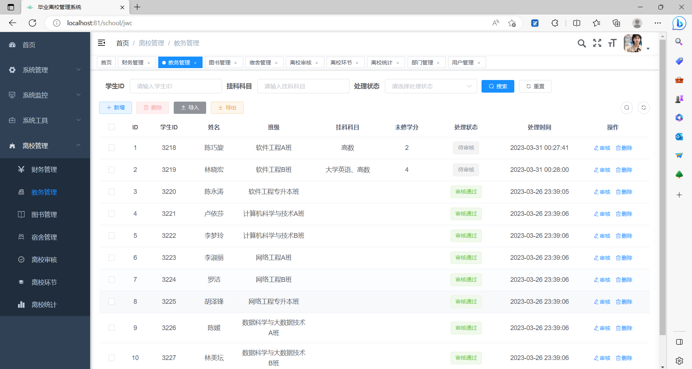

> 图书信息管理模块
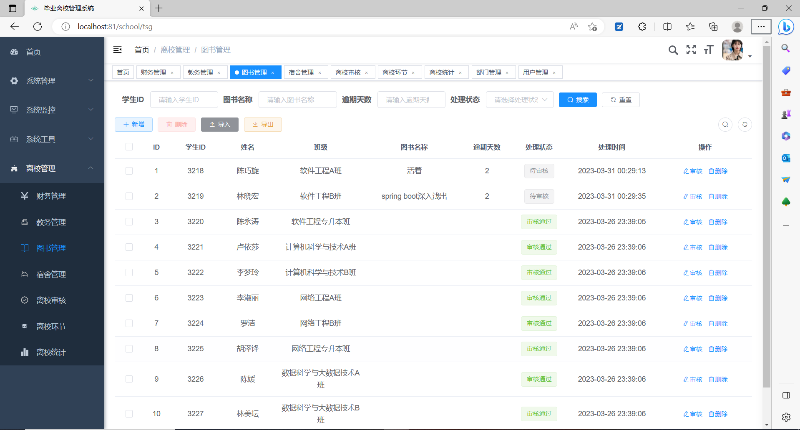

> 宿舍信息管理模块
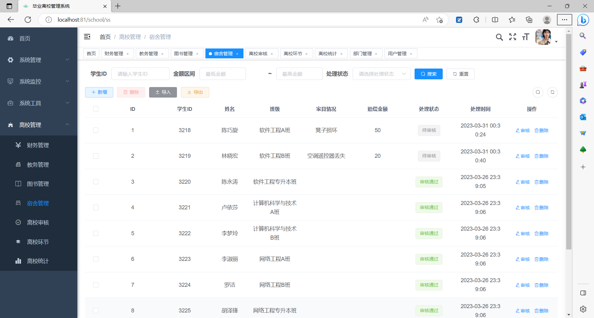

> 离校审核模块
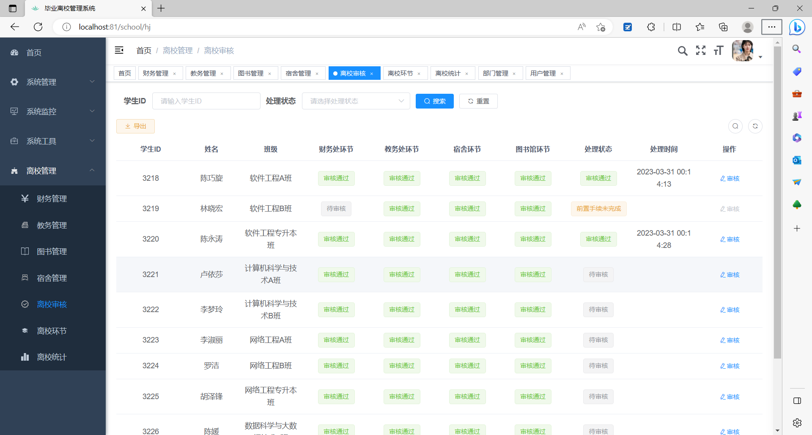

> 离校信息模块
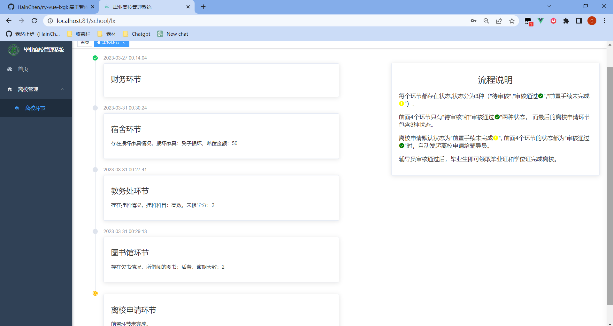

> 离校统计模块
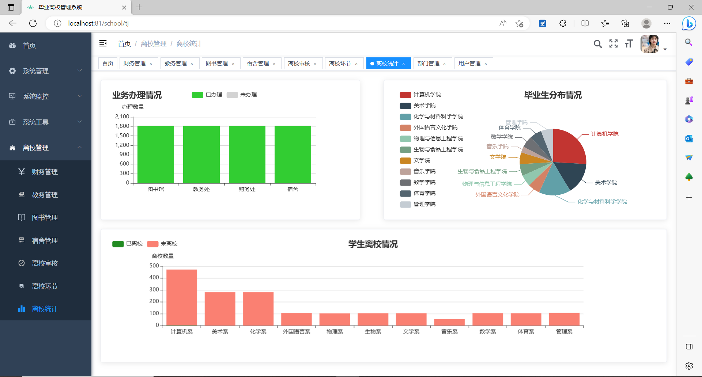

# 系统管理模块
系统管理模块主要包含了用户登录、用户管理、角色管理、菜单管理、部门管理、字典管理、通知公告、日志管理。
> 用户登录
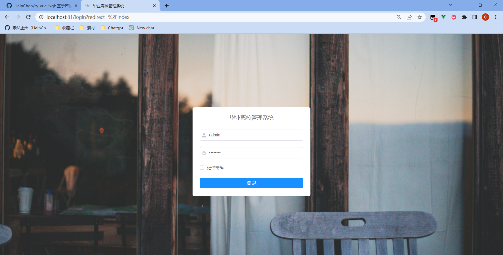

> 角色管理
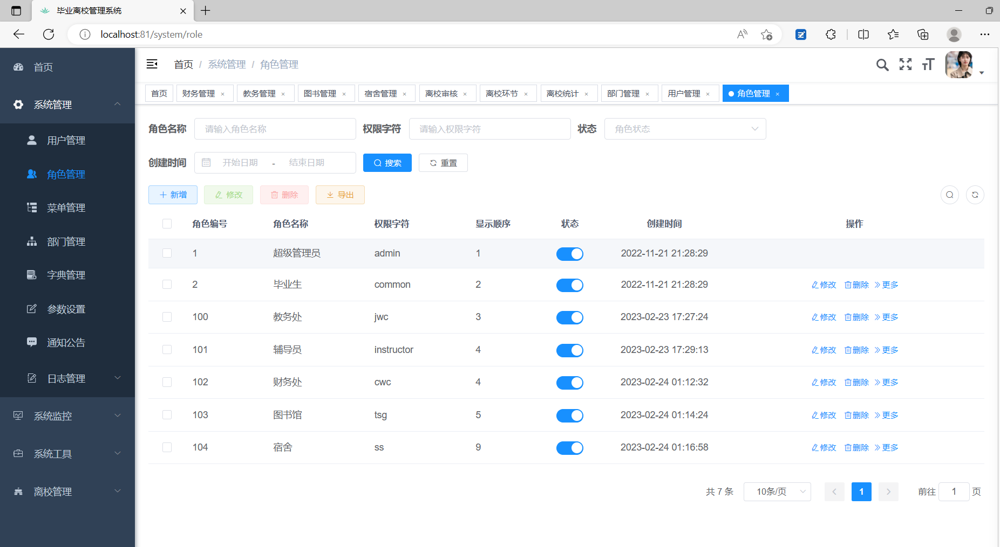

> 菜单管理
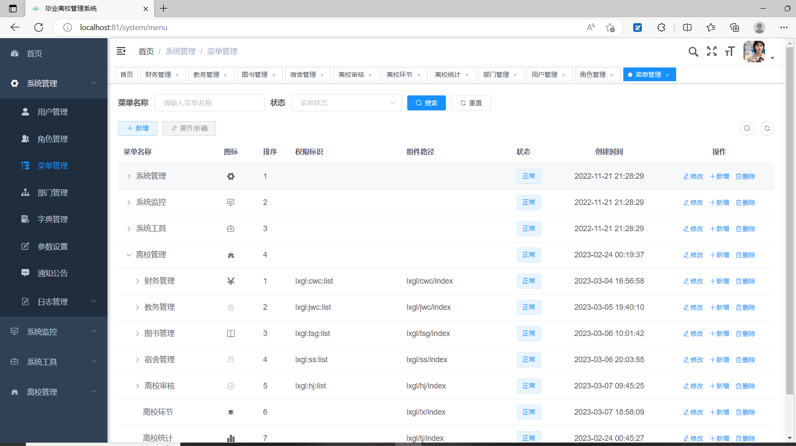

> 部门管理
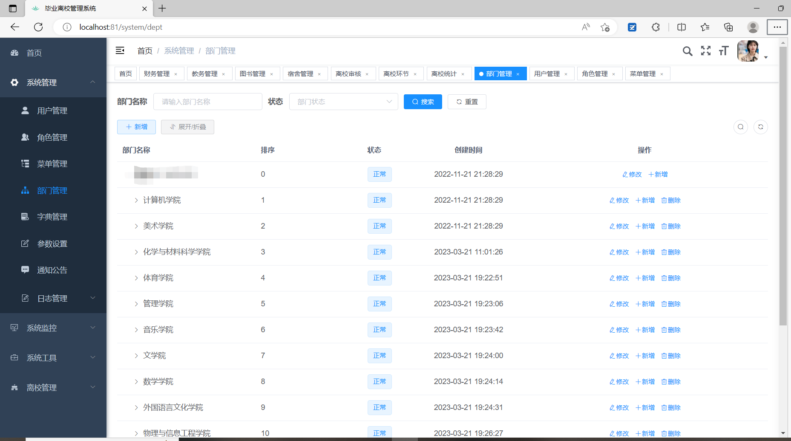

> 字典管理
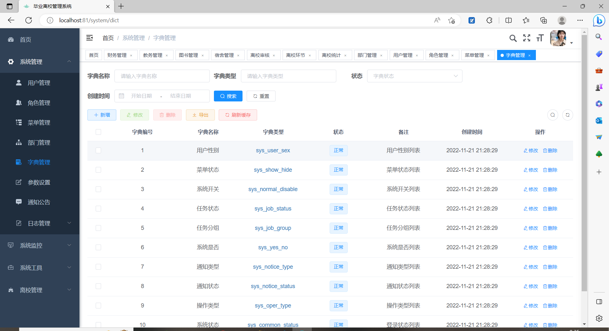

> 通知公告
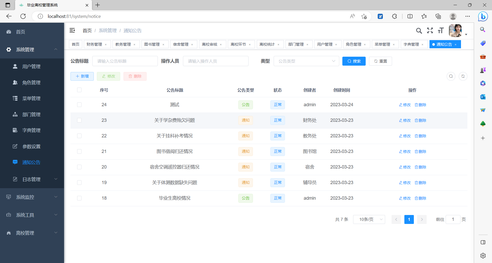
> 首页显示
> 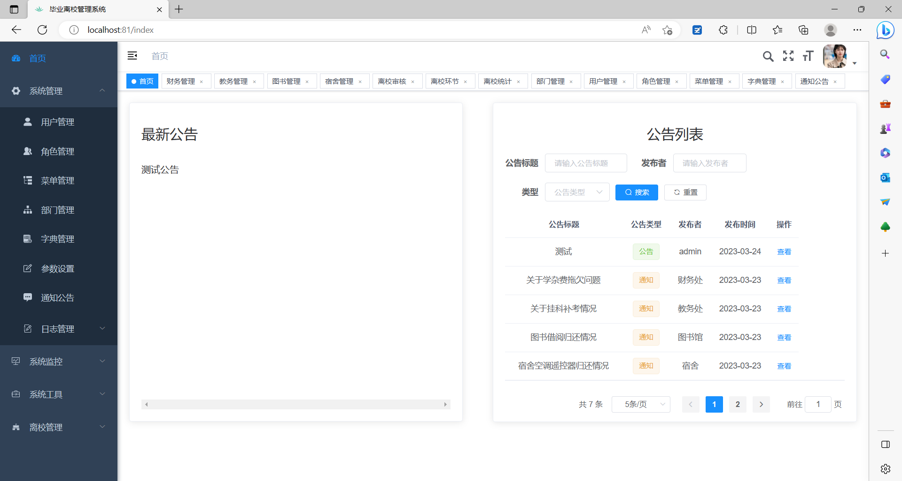

> 日志管理
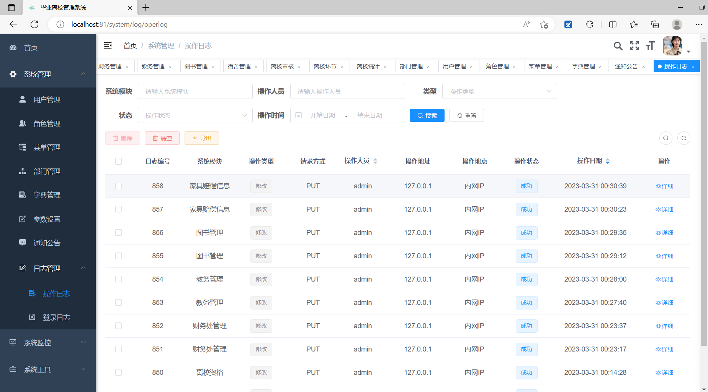
